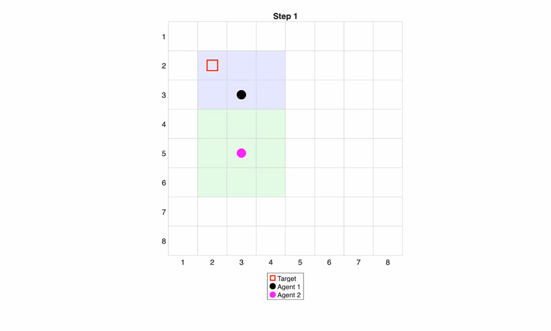

# SD2026 – Multi-Agent Search and Communication Testbed

SD2026 is our Senior Design project (UMass Boston, ENGIN 491/492, Team 4) focused on building a multi-agent system that can search for a target while operating under unreliable communication conditions. The system uses mobile agents, a centralized Mission Leader, and hybrid RF/Optical Wireless Communication (OWC). Agents collect local information about their position and surroundings, send it to the Mission Leader, and receive movement commands back.

## My Contribution – Q-Learning

My main contribution was the **Q-learning / MARL movement module**. I first developed the behavior in simulation, starting with simple random movement and gradually adding multiple agents, target detection, limited vision, and step-count measurements.



*One frame from the 8x8 simulation (December 2025): two agents, each seeing a 3x3 area around itself, searching for a target. Short clip: [docs/marl_2agents_1target_8x8.mp4](docs/marl_2agents_1target_8x8.mp4).*

The Q-learning module replaces the random moves the Mission Leader used before with learned movement decisions. The goal is for the Mission Leader to learn which actions — **up, down, left, or right** — lead to the target most efficiently. Rewards and penalties are used to update the Q-values over repeated trials so the agents can reduce unnecessary movement and improve their search strategy.

## What's in this repo

- `ml_decide.py`: my Q-learning decision module. For each robot it builds the state (row, col, direction to the nearest unexplored cell, direction to the nearest ally), picks up/down/left/right from the trained Q-table, and converts that into a robot command (`forward`, `backward`, `turn_left`, `turn_right`) based on which way the robot is facing. If the Q-table has no entry for a state, the robot moves toward the nearest unexplored cell.
- `mapingfromtxtfile.py`: turns each robot's 16-character sensor reading into its position (row, col) and facing on the 7x9 map.
- `ML_Script.sh`: the Mission Leader loop. It maps both robots, calls `ml_decide.py`, and sends each robot its command over SSH.

## Running it

This needs the two Raspberry Pi robots on the lab network (10.1.1.120 and 10.1.1.121) and a trained `q_tables.pkl` in the same folder.

```bash
./ML_Script.sh 1                              # run episode 1
```

To test just the decision step (needs `results/compact_map_result_120.txt` and `results/compact_map_result_121.txt`):

```bash
python3 ml_decide.py --ep 1 --nodes 120 121   # prints e.g. "forward,turn_left"
```

## Not included

- The simulation code I used to train the Q-tables, and the trained `q_tables.pkl`
- `random_walk_tx.sh`, which runs on each Raspberry Pi
