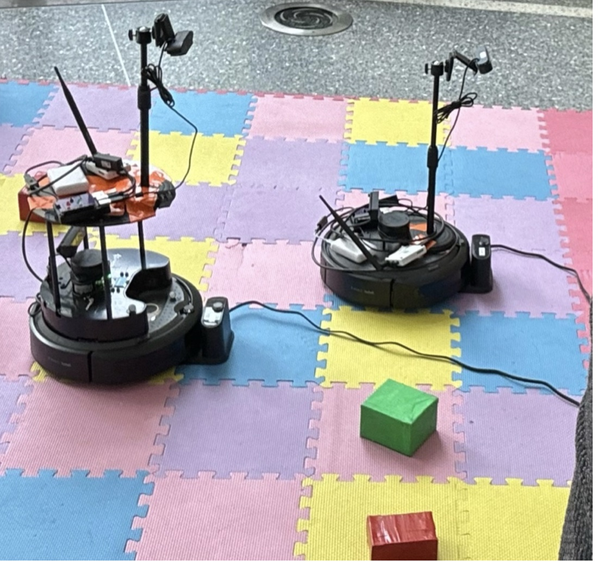
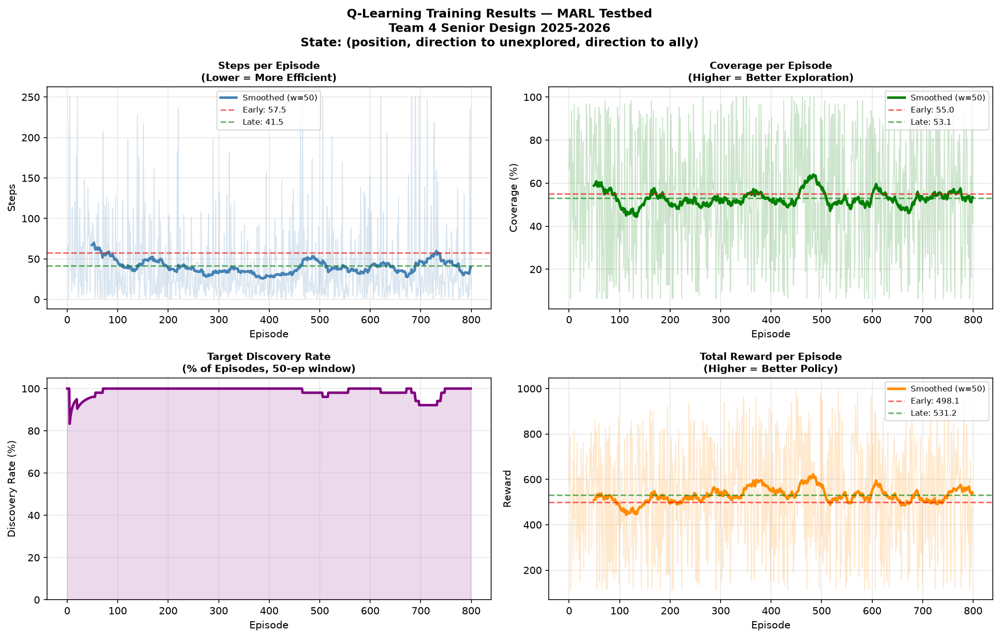

# SD2026 – Multi-Agent Search and Communication Testbed

SD2026 is our Senior Design project (UMass Boston, ENGIN 491/492, Team 4) focused on building a multi-agent system that can search for a target while operating under unreliable communication conditions. The system uses mobile agents, a centralized Mission Leader, and hybrid RF/Optical Wireless Communication (OWC). Agents collect local information about their position and surroundings, send it to the Mission Leader, and receive movement commands back.



The final system uses two TurtleBot4 robots on a 7x9 colored tile map and a laptop as the Mission Leader. Each robot uses its camera to read the colors of the 8 cells around it, and the Mission Leader matches that pattern against the map to find the robot's cell and facing direction. The robots explore until one of them finds the hidden target; after that, both drive to it along A* shortest paths. Our team had seven people in a communications group (RF and OWC links, GNU Radio, status-indicator PCB) and a mobility group (camera sensing, TurtleBot4 control, and the decision-making). I was in the mobility group.

## My Contribution – Q-Learning

My main contribution was the **Q-learning / MARL movement module**. I first developed the behavior in simulation, starting with simple random movement and gradually adding multiple agents, target detection, limited vision, and step-count measurements.


*One frame from my first-semester MATLAB simulation (December 2025): two agents, each seeing a 3x3 area around itself, searching for a target. Short clip: [docs/marl_2agents_1target_8x8.mp4](docs/marl_2agents_1target_8x8.mp4).*

The Q-learning module replaces the random moves the Mission Leader used before with learned movement decisions. The goal is for the Mission Leader to learn which actions — **up, down, left, or right** — lead to the target most efficiently. Rewards and penalties are used to update the Q-values over repeated trials so the agents can reduce unnecessary movement and improve their search strategy.

What I worked on:

- Moved the simulation from MATLAB to Python and wrote the Q-learning trainer (`q_trainer.py`): the state, the Q-table updates, epsilon-greedy exploration, and saving the trained Q-tables.
- Wrote `ml_decide.py`, which the Mission Leader runs every cycle to turn the Q-table into a command for each robot.
- Rewrote `mapingfromtxtfile.py` so it returns correct row and column coordinates, and updated `ML_Script.sh` to run two robots with the Q-learning module.
- Designed and checked the 7x9 map so that each of the 35 interior cells has a unique 3x3 color pattern from all four facing directions. That is what lets the Mission Leader localize a robot from a single camera scan.

I first tried a decision tree trained on labeled simulation data, but it only reached about 58–59% accuracy and needed to know where the target was, which the robots can't know while searching. That is why I switched to Q-learning.

## Training

`q_trainer.py` trains one Q-table per robot in a simulation of the 7x9 map. Each episode the target and both robots start at random cells, and the episode ends when a robot reaches the target or after 250 steps.

- State: (row, col, direction to the nearest unexplored cell, direction to the nearest ally), where a direction is one of 8 compass directions or none
- Actions: up, down, left, right
- Rewards: +100 for reaching the target, +15 for a new cell, −3 for a revisited cell, +5 for moving away from the ally, −1 per step
- 800 episodes, α = 0.25, γ = 0.85, ε from 1.0 down to 0.05 (multiplied by 0.993 each episode), random seed 42



With this code, the average number of steps to find the target dropped from 57.5 in the first 100 episodes to 41.5 in the last 100, and the robots found the target in all of the last 100 episodes. Coverage stayed around 50–55%, so the gain comes from finding the target faster rather than from exploring more of the map. The trainer saves the Q-tables from the episode window with the best coverage, not the final ones.

The training simulation is simpler than the real system: there are no obstacles, no communication loss, and every move succeeds.

## What's in this repo

- `q_trainer.py`: trains the Q-tables in simulation and saves `q_tables.pkl` and `q_training_results.png`.
- `q_tables.pkl`: the trained Q-tables from the run above.
- `ml_decide.py`: my Q-learning decision module. For each robot it builds the state (row, col, direction to the nearest unexplored cell, direction to the nearest ally), picks up/down/left/right from the trained Q-table, and converts that into a robot command (`forward`, `backward`, `turn_left`, `turn_right`) based on which way the robot is facing. If the Q-table has no entry for a state, the robot moves toward the nearest unexplored cell.
- `mapingfromtxtfile.py`: turns each robot's 16-character sensor reading into its position (row, col) and facing on the 7x9 map.
- `ML_Script.sh`: the Mission Leader loop. It maps both robots, calls `ml_decide.py`, and sends each robot its command over SSH.

## Running it

Train the Q-tables (needs Python 3 with NumPy and Matplotlib; takes a few seconds):

```bash
python3 q_trainer.py
```

Run the full system. This needs the two robots on the lab network (10.1.1.120 and 10.1.1.121):

```bash
./ML_Script.sh 1                              # run episode 1
```

To test just the decision step (needs `results/compact_map_result_120.txt` and `results/compact_map_result_121.txt`):

```bash
python3 ml_decide.py --ep 1 --nodes 120 121   # prints e.g. "forward,turn_left"
```

## Not included

- The original MATLAB simulation from the first semester
- `random_walk_tx.sh`, which runs on each robot, and the communications team's RF/OWC code

Supervisor: Professor Michael Rahaim, UMass Boston.
